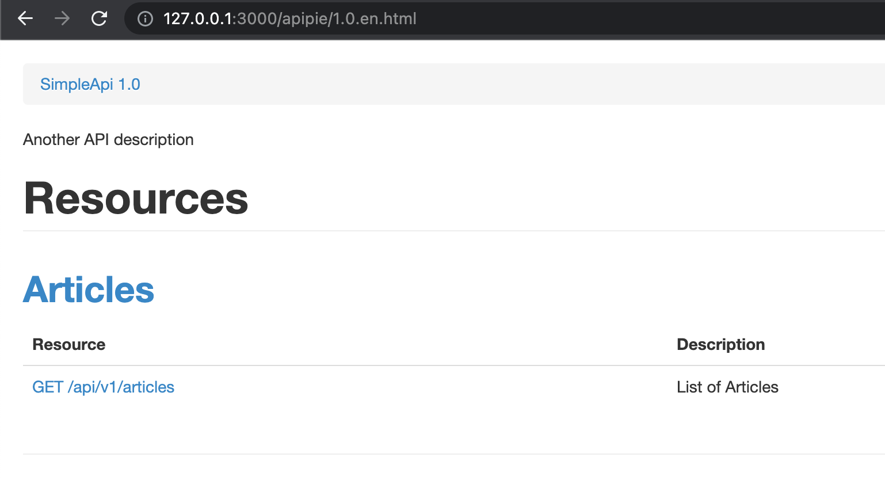
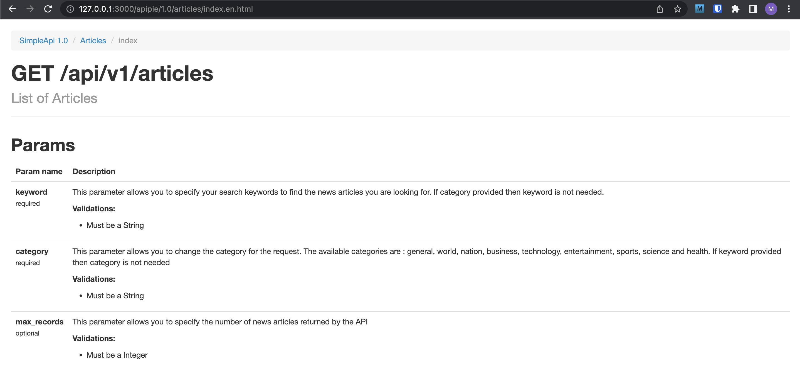
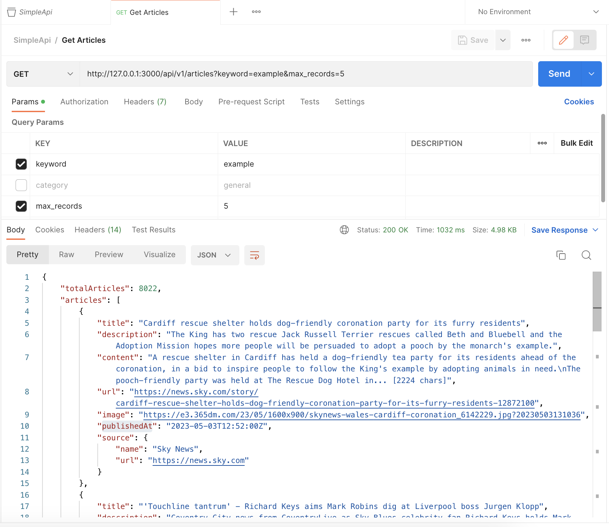
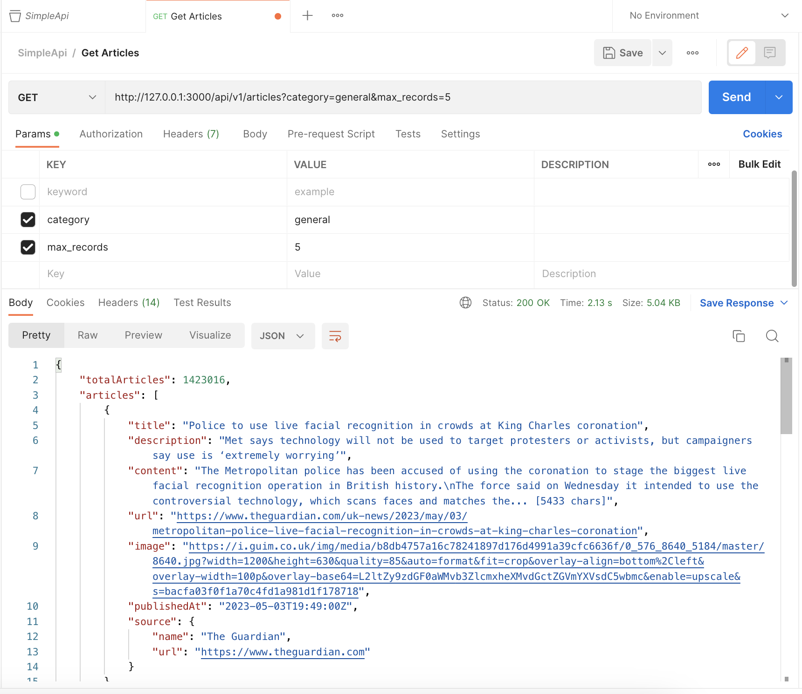

# Simple API

Simple API interacts with [GNews API](https://gnews.io/) for fetching articles.

## Installation

* Clone the repository from [Simple API Repo](git@github.com:mayalces/simple_api.git)
* Configure the API key for `GNews API` in `.env.development` file
* Execute

```
    $ bundle install
    $ rails s
```

## Usage

The API contains one enpoint: `/api/v1/articles`. The endpoint documentation can be found at [Simple API Documentation](http://127.0.0.1:3000/apipie/1.0.en.html)



### List Articles documentation:


### List Articles By Keyword Postman:


### List Articles By Category Postman:


## Contributing

Create a branch in the `upstream` repo and submit a `pull request`, please.
